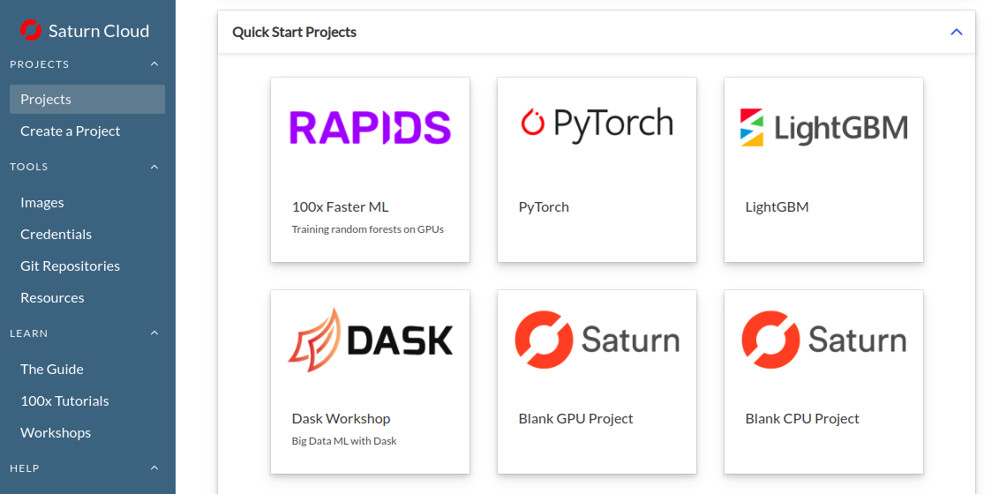

# workshop-lightgbm-dask

This repo contains demo code for a Saturn Cloud workshop, "Scaling LightGBM Training with Dask on Saturn Cloud".

## Prerequisites

Attendees must have an account on Saturn Cloud Community. You can sign up for free at https://accounts.community.saturnenterprise.io/auth/signup.

## Setup

1. Once logged in to Saturn, go to the "Projects" page. Select LightGBM from "Quick Start Projects"

2. Click "Create" on the next screen. This will create a project called `lightgbm`.
3. Start the Jupyter instance and Dask cluster.
4. Once Jupyter is running, click "JupyterLab" to open Jupyter Lab.
5. Open `01-lightgbm.ipynb`, and run the cells in order.

## Where to Learn More

For more information about past and future Saturn events see https://www.saturncloud.io/s/events/.

For a deeper discussion of Dask and LightGBM, see ["LightGBM Training with Dask"](https://www.saturncloud.io/docs/tutorials/lightgbm/).

For more information on LightGBM, see https://lightgbm.readthedocs.io/en/latest/.
